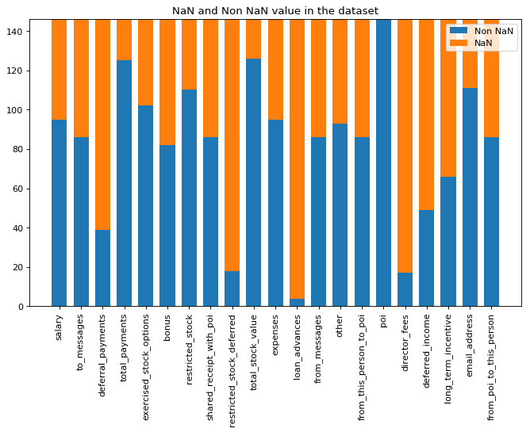

# Identify Fraud from Enron Emails

# Workflow
1) Get the data from the pickle file
2) Explore the data
3) Cleanup the data (process the 'NaN' and remove the TOTAL entry)
4) Check for ouliers
5) Remove the outliers
6) Add meta-features
7) Select the features (SelectKBest, SelectPercentile or lasso of sklearn)
8) Run a classifer
9) Check the precision and recall 
10) Tune the classifier parameter and iterate to step 6 with another classifer
11) Iterate to step 5 to try with another set of features

# Foreword
# Question 1: Goal of the project and Data exploration
The goal of this project is to identify the persons of interest in a dataset created after the Enron scandal of 2001. In such scandal a lot of people are involved and it is very hard to know who played a role and most importantly who took benefices of the situation. Find the really guilty people is quite difficult. The amount of data is also quite huge. Mails, financital data, legal documents... To perform the investigation some machine learning technics can help to focus on some relevant people.

The provided dataset contains some financial data about people who was involved in the Enron's business. In the dataset there is 146 entries and for each entrie there is 21 attributes. We can see a lot of 'NaN' value. Alltogether there is 44% of the value are 'NaN'. Most of the values of the attribute 'loan_advance' are 'NaN'. All values of the POI attribute are right (0 or 1). We have 18 entries tagged as POI in the dataset.

About the outliers. An entry is the total of all the value and has to be removed. To find other outliers a z-score was used to find the values which differ from the standard. All values with a z-score greater than 4 or smaller than -2 were inspected. It represent 38 values. Nothing were found inrealsitic. 2 people sent more than 12000 email. Those two values could have an impact of the classifer but the total amount of mail is probably not very discriminent to detect the POI. No correction are needed here but if we choose the amount of mail sent as a feature for the classifer, we have to keep in mind there is some extrem values.

# Question 2: Features selection
In the dataset we can exclude the 'email_address' attribute from the feature selection. This attribute is unique for each people and add no classification information as it is. It is possible to extract the company name from the email address. This approch will not be taken here because the dataset is focused on the individual benefit of people and not of the benefit of each company.

We saw during the data exploration that some attributes contain a lot of NaN. The dataset contains several type of financial data. We can add a feature which merge all the benefits. It is easy to calculate. It is total_payments + total_stock_value. Another feature we can add is the ratio of mail send or received to or from a POIs. If somebody exchange a lot with a POI, this person could be involved in the fraud. Here we add two features:  from_poi_to_this_person / to_message and from_this_person_to_poi / from_message.

To select the feature the SelectKBest algorithm was used. The scores show some features score more than 15 and the others are quite lower. We selected a subset of 6 features

| Feature | Score |
---|---
| bonus 	| 21.060002 |
| total_stock_value 	| 24.467654 |
| salary 	| 18.575703 |
| fraction_to_poi 	| 16.641707 |
| exercised_stock_options 	| 25.097542 |
| total_benefit 	| 17.187006 |

# Question 3: Choice of an algorithm
# Question 4: Tuning of the parameters of the algorithm
# Question 5: Validation
# Question 6: Evaluation metrics

# Cleanup the data
We have here two sort of non valid data:
- The 'NaN' data which is a text format and does not work with digital values. All 'NaN' value will be replaced by 0. This is done by the function featureFormat with the paramater 'remove_NaN' which is true per default.  
- The TOTAL entry which sum each columns of the dataset. This entry must be removed.

In the dataset, there is a field "email address". This information is not usefull to identify the POIs (it is unique for each people). This field should be removed.

# Check for outliers
The analysis show that the data are quite widely distributed. To target the values which have an extrem value a z-Score calculation was performed. The results was check and all values are quite plausible. Just two values related to the number of mail sent are quite high. Possible but high. It is a point we have to keep in mind if this attribute is used as a feature.

# Add meta-features
Three meta-features are added:
- The total benefit (total_payments + total_stock_value)
- The from and to POI fractions (mail sent to/from POI divided by the total amount of from/to mail)

# Select the features
# Run a classifier
# Check the accuracy, precision and recall 
# Validation
- estimate the performance on real world data
- help to detect overfitting

validation with RMSD root mean square deviation (test = training --> no overfit)
